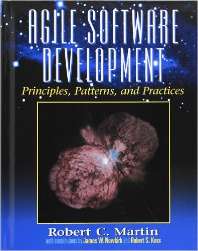

layout: true
class: center, middle, inverse
---
<br><br>
### An introduction to the

# SOLID

### principles of object-oriented design

<br><br><br><br><br><br><br>
### November 13, 2017
### Rocco Palladino

---
layout: false
class: middle

## What is software design?

.float-right[

]
.quote[Every application is a collection of code; the code's arrangement is it's design. Design is thus an art, the art of arranging code. <br>
.float-right[&mdash;Sandi Metz]
]

<br>
.footnote[Source: [Practical Object-Oriented Design in Ruby](http://www.poodr.com/), p. 4]

---

## Why does design matter?

Because software requirements change&mdash;they always do.

.quote[The difficulty of design is that every problem has two components. You must not only write code for the feature you plan to deliver today, you must also write code that is amenable to being changed later. [...] The future that design considers is not one in which you anticipate unknown requirements and preemptively choose one from among them to implement in the present. <br>
<br>
The purpose of design is to allow you to do design <em>later</em> and its primary goal is to reduce the cost of change.
.float-right[&mdash;Sandi Metz]]

---

## The tools of design

### Design Principles
- DRY, YAGNI
- SOLID
- Law of Demeter (LoD)

### Design Patterns
- Gang of Four (GoF; Gamma, Helm, Johnson, Vlissides)
- PEAA (Martin Fowler)
- DDD (Eric Evans)
- Pattern abuse

---
.float-right[

]


# SOLID

- <b><u>S</u></b>ingle Responsibility Principle

- <b><u>O</u></b>pen/Closed Principle

- <b><u>L</u></b>iskov Substitution Principle

- <b><u>I</u></b>ntegration Segregation Principle

- <b><u>D</u></b>ependency Inversion Principle

---

# SOLID

.quote[These principles expose the dependency management aspects of OOD as opposed to the conceptualization and modeling aspects. Dependency management is an issue that most of us have faced. Whenever we bring up on our screens a nasty batch of tangled legacy code, we are experiencing the results of poor dependency management. Poor dependency managment leads to code that is hard to change, fragile, and non-reusable.
<br>
.float-right[&mdash;Uncle Bob]]

### Managing Dependencies
- Maximize Cohesion: Putting similar things together.

- Minimize Coupling: Keeping different things apart.

<br>
.footnote[Source: [The Principles of OOD](http://butunclebob.com/ArticleS.UncleBob.PrinciplesOfOod)]

---
background-image: url(images/SingleResponsibilityPrinciple2_71060858.jpg)
---

# SRP: Single Responsibility Principle

.quote[A software module should have only one reason to change.]

- Not: it should only do one thing

- A responsibility is a "reason to change"

- A "reason to change" should align with business needs

---

# SRP: Single Responsibility Principle

Problem: Three methods, three reasons to change

```
class Employee
{
    public static function generateReport()
    {
        // Change if CEO needs format of report to change
    }

    public function calculatePay()
    {
        // Change if accountants need a new way of calculating pay
    }

    public function saveToDatabase()
    {
        // Change if developers need to modify the schema
    }
}

```

As this class changes, those that depend upon it might also suffer through those changes.

Do not _simply_ gather together functions that happen to operate on the same data structure.

---

# SRP: Single Responsibility Principle

Solution: Group together things that change for the same reason; separate things that change for different reasons.

```
class Employee
{
    public function calculatePay()
    {
        //
    }
}

class EmployeeGateway
{
    public function save(Employee $employee)
    {
        //
    }
}

class EmployeeReport
{
    public function generateReport()
    {
        //
    }
}
```
---
background-image: url(images/OpenClosedPrinciple2_2C596E17.jpg)
---

# OCP: Open-Closed Principle

.quote[Software entities (classes, modules, functions, etc.) should be open for extension, but closed for modification.]

- Coined in 1988 by Bertrand Meyer in _Object Oriented Software Construction_

- "Open for extension": Behavior of a module can be extended as requirements change.

- "Closed for modification": Extending behavior does not result in changes to the module being extended.

- Abstraction is the key

---

# OCP: Open-Closed Principle

```
class Responder
{
    public function send(Response $response)
    {
        header("Content-Type: text/html");
        echo $response->getContent();
    }
}

```
--

New requirement: API needs to respond with JSON

```
    public function send(Response $response)
    {
        if ($response->getType() == 'json') {
            header("Content-Type: application/json");
        } else {
            header("Content-Type: text/html")
        }
        echo $response->getContent();
    }
```
--
### OCP Violation!

---

# OCP: Open-Closed Principle

```
class Responder {
    public function send(Response $response) {
        header("Content-Type: {$response->getContentType()}");
        echo $response->getContent();
    }
}

interface Response {
    public function getContentType();
    public function getContent();
}

class JsonResponse implements Response {
    public function getContentType() {
        return "application/json";
    }
}

class HtmlResponse implements Response {
    public function getContentType() {
        return "text/html";
    }
}
```

---

# OCP: Open-Closed Principle

## Strategy Pattern (GoF)
<br><br>


---

background-image: url(images/LiskovSubtitutionPrinciple_52BB5162.jpg)

---

# LSP: Liskov Substitution Principle

.quote[If for each object <em>o</em><sub>1</sub> of type _S_ there is an object <em>o</em><sub>2</sub> of type _T_ such that for all programs _P_ defined in terms of _T_, the behavior of _P_ is unchanged when _o_<sub>1</sub> is substituted for _o_<sub>2</sub> then _S_ is a subtype of _T_.
<br>
.float-right[&mdash;Barbara Liskov, 1988]]

- The one that makes you sound smart

- You do not a Computer Science PhD to understand it

- Subtypes must be substitutable for their base types
---

# LSP: Liskov Substitution Principle

.quote[If you're used to driving a Chevrolet, you shouldn't be too surprised when you get into a Volkswagen. You should still be able to drive it.
<br>
.float-right[&mdash;Uncle Bob]]

- There's an interface, you use that interface, lots of things implement that interface, and none of them should surprise you

- Surprise! It's a runtime error!

- Canonical example is the Rectangle-Square problem

---

# LSP: Liskov Substitution Principle

Our responder example:

```
class Responder {
    public function send(Response $response) {
        header("Content-Type: {$response->getContentType()}");
        echo $response->getContent();
    }
}

abstract class Response {
    public function setContent($content) {
        $this->content = $content;
    }

    public function getContent() {
        return $this->content;
    }
}

class JsonResponse extends Response {
    public function getContentType() {
        return "application/json";
    }
}
```
---

# LSP: Liskov Substitution Principle

```
$html = new HtmlResponse()
$html->setContent('Hello, world.');

$responder = new Responder();
$responder->send($html);
```
--

.quote[Hello, world.]
--

```
$user = new User();
$user->setName("Rocco Palladino");
$user->setEmail("rpalladino@activecampaign.com");

$json = new JsonResponse();
$json->setContent($user);

$responder = new Responder();
$responder->send($json);
```
--

.quote[PHP error:  Object of class User could not be converted to string]

---

# LSP: Liskov Substitution Principle

```
abstract class Response {
    public function setContent($content) {
        $this->content = $content;
    }

    public function getContent() {
        return $this->content;
    }
}

class Responder {
    public function send(Response $response) {
        header("Content-Type: {$response->getContentType()}");

        if ($response instanceof JsonResponse) {
            echo json_encode($response->getContent());
        } else {
            echo $response->getContent();
        }
    }
}
```
--

## OCP Violation!

---
# LSP: Liskov Substitution Principle

### Better solution

```
class Responder {
    public function send(Response $response) {
        header("Content-Type: {$response->getContentType()}");
        echo $response->getContent();
    }
}

class JsonResponse extends Response {
    public function getContentType() {
        return "application/json";
    }

    public function getContent() {
        return json_encode($this->content);
    }
}
```

---

# LSP: Liskov Substitution Principle

### Better solution (PHP 7)

```
class Responder {
    public function send(Response $response) {
        header("Content-Type: {$response->getContentType()}");
        echo $response->getContent();
    }
}

class JsonResponse extends Response {
    public function getContentType() {
        return "application/json";
    }

    public function getContent() : string {
        return json_encode($this->content);
    }
}

abstract class Response {
    public function getContent() : string {
        return $this->content;
    }
}

```

---

background-image: url(images/InterfaceSegregationPrinciple_60216468.jpg)

---

# ISP: Interface Segregation Principle

.quote[Clients should not be force to depend on methods they do not use]

- Applies to "fat" classes, with many, many methods and lots of clients that use it

- The interface of that class can be broken up into groups of methods

- Each group serves a different set of clients

---

# ISP: Interface Segregation Principle

## Active Record Pattern (PEAA)

.quote[An object wraps a row in a database table or view, encapsulates the database access, and adds domain logic on that data.]

```
class Person
{
    public $lastName;
    public $firstName;
    public $numberOfDependents;

    public function insert() { ... };
    public function update() { ... };
    public function delete() { ... };

    public function getExemption() { ... };
    public function isFlaggedForAudit() { ... };
    public function getTaxableEarnings() { ... };
}
```

---

# ISP: Interface Segregation Principle

## Segregate the interfaces

```
interface PersistencePerson
{
    public function insert();
    public function update();
    public function delete();
}

interface DomainPerson
{
    public function getExemption();
    public function isFlaggedForAudit();
    public function getTaxableEarnings();
}

class Person implements PersistencePerson, DomainPerson {
    //
}
```

---

# ISP: Interface Segregation Principle

## Clients can depend on the interfaces they need

```
class PersonRepository
{
    public function save(PersistencePerson $person) {
        //
    }
}

class PayrollCalculator {
    public function calculatePay(DomainPerson $person) {
        //
    }
}
```

---

background-image: url(images/DependencyInversionPrinciple_0278F9E2.jpg)

---

# DIP: Dependency Inversion Principle

.quote[
1. High-level modules should not depend on low-level modules. Both should depend on abstractions.

2. Abstractions should not depend on details. Details should depend on abstractions.
]

- Depend on abstractions, not on concretions.

- Almost a restatement of the Open-Closed Principle. Remember, _abstractions_ is the key.

---

# DIP: Dependency Inversion Principle

Recall our original responder example:

```
class Responder {
    public function send(HtmlResponse $response) {
        header("Content-Type: text/html");
        echo $response->getContent();
    }
}

class HtmlResponse {
    public function getContent() {
        return $this->content;
    }
}

```

- `Responder` depends on a concrete `HtmlResponse`

- It can render `HtmlResponse` objects and _only_ `HtmlResponse` objects

---

# DIP: Dependency Inversion Principle

```
class Responder {
    public function send(Response $response) {
        header("Content-Type: $response->getContentType()");
        echo $response->getContent();
    }
}

abstract class Response {
    public function getContent() {
        return $this->content;
    }
}

class HtmlResponse extends Response {
    public function getContentType() {
        return "text/html";
    }
}

```

- `Responder` depends on an abstraction, `Response`.

- `HtmlResponse` implements the interface of `Response`.

- Thus, `HtmlResponse` is now doing the depending, rather than being depended upon.

---
layout: true
class: center, middle, inverse
---

# Questions?
